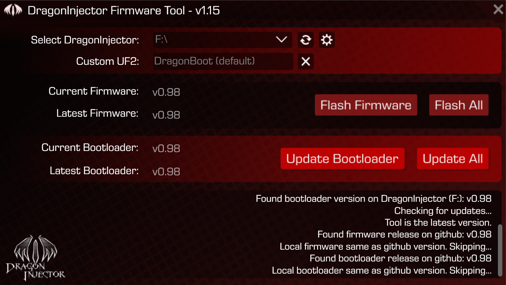
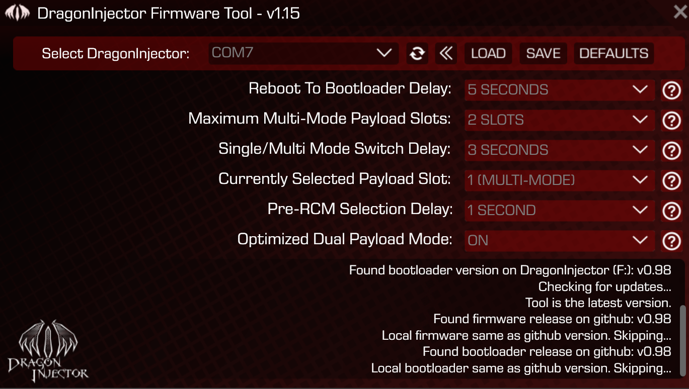

# DragonInjector Firmware Tool

This tool is for use with the DragonInjector payload injector.
   

  

  
# Usage
1) Download the latest release, unzip, and run DragonInjector Firmware Tool.exe
2) Upon loading, the tool will check and download the latest bootloader and firmware from github if you don't have them.
3) Insert your DragonInjector into your computer via USB-C adaptor or a USB-C port if you have one.
4) Wait for the LED to turn blue - approximately 5 seconds.
5) Select your DragonInjector from the dropdown menu in the Firmware Tool
6) From here you can update bootloader and firmware to the latest version by pressing flash firmware or update bootloader.

# Settings Usage
1) Click the gear.
2) Choose your COM port.
3) Select a setting. After clicking a setting it will immediately commit it.
4) For backing up and restoring, use the save/load features.
5) To reset to factory state, select the default option.

# Advanced Usage
If you don't want the default firmware you can load a custom uf2 firmware by selecting it above the DragonInjector and then flashing it.
To return to the default firmware, press the X next to UF2 selection, then press flash firmware.

***!!! WARNING !!!***

Untrusted custom UF2 files **might** brick your DragonInjector. The only way to recover from this is with a SWD Programmer.
We take no liability if you do this. Please be safe if you are using the custom UF2 feature.

Note: Update all and flash all are for if you have multiple DragonInjectors connected.
  
# Credits

**MatinatorX**- For developing the Dragoninjector and bootloader and concept for the firmware tool.

**StuckPixel** - For helping with the firmware and bootloader.

**Jerome** - For developing the DragonInjector Firmware Tool based on the concept by Matinator.

**The Fuzz** - For helping maintain the discord server.

**The Testers** - For testing the products and providing valuable feedback.

*And everyone else who has supported the DragonInjector project.*
